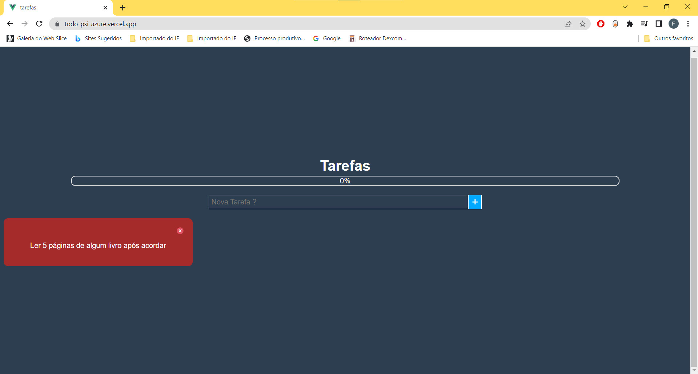
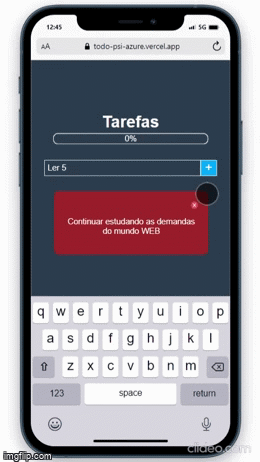

# Lista de Tarefas

Anote suas tarefas e tenha seu dia mais organizado.




##### Design responsivo e armazenamento local no navegador usando Local Storage.



## 🚀 Começando

Essas instruções permitirão que você obtenha uma cópia do projeto em operação na sua máquina local para fins de desenvolvimento e teste.

- Tenha o NodeJs em sua máquina local
- Clone este repositório
- Use o comando

```
 "npm run serve"
```

E veja o projeto rodando localmente no endereço

```
http://localhost:8080
```

## 🛠️ Construído com

  

- Javascipt
- VueJs
- Html
- Css

##  Veja o em produção

<a href="https://todo-psi-azure.vercel.app/" target="_blank">Clique aqui para ver o projeto em funcionamento </a>
